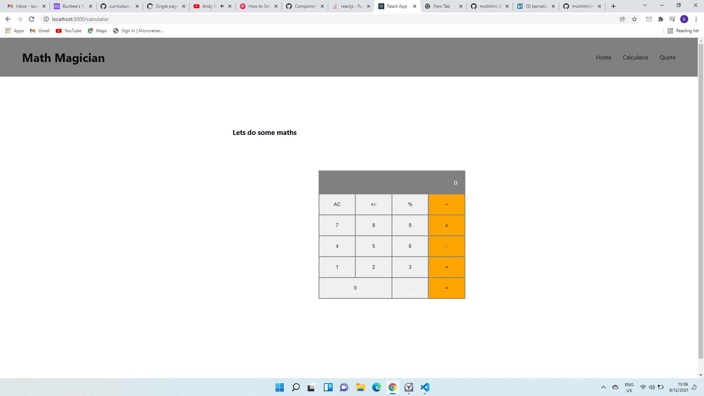

https://bunbee.netlify.app/
https://maths-magicians-bunbee.herokuapp.com/
## About The Project

"Math magicians" is a website for all fans of mathematics. It is a Single Page App (SPA) that allows users to:
Make simple calculations.
Read a random math-related quote.

### Built With

- [HTML](https://www.w3schools.com/html/)
- [CSS](https://www.w3schools.com/css/)
- [JS](https://www.javascript.com/)
- [React js](https://www.reactjs.org)

## Authors
👤 **Bunbee**

- GitHub: [@Bunbee](https://github.com/mutinhiri)
- Twitter: [@Bunbee02](https://twitter.com/)
- LinkedIn: [barnabas mutinhiri](https://www.linkedin.com/in/bunbee/)

## Getting Started

- You will not need additional instructions on installing Prerequisites.
- In case you have node_modules on your folder Add them to .gitignore file before you a push.

### Prerequisites

- No prerequisites needed for this project.

### Installation


1. Clone the repo
   ```sh
   https://github.com/mutinhiri/maths-magician.git
   ```

2. Install NPM packages
   ```sh
   npm install
   ```
3. Run server
   ```sh
   npm start
   ```

## Roadmap

See the [open issues](https://github.com/mutinhiri/maths-magician/issues) for a list of proposed features (and known issues).

## Contributing

Contributions are what make the open source community such an amazing place to be learn, inspire, and create. Any contributions you make are **greatly appreciated**.

1. Fork the Project
2. Create your Feature Branch (`git checkout -b feature/NewFeature`)
3. Commit your Changes (`git commit -m 'Add some NewFeature'`)
4. Push to the Branch (`git push origin feature/NewFeature`)
5. Open a Pull Request

## License

License Free.

## Acknowledgements

- [GitHub Pages](https://pages.github.com)
- [WebPack](https://webpack.js.org/)
